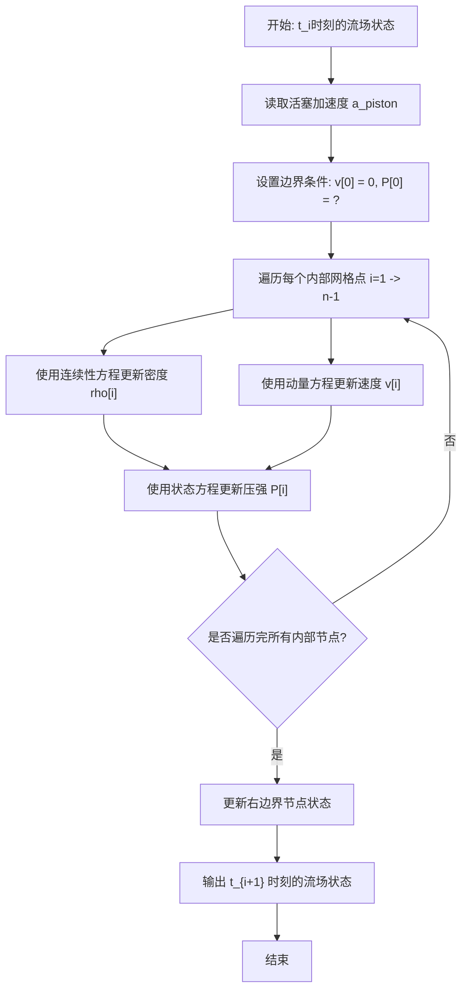

# 导弹与运载火箭气动计算大作业
## 题设
一个无限长的光滑直线导管，横截面积为1$m^2$，导管内有一个活塞，质量为1$kg$，左侧为真空，右侧充满空气。

初始时刻活塞和空气都静止。之后，活塞收到向右的推动力，产生加速度为：
$$a=\left\{\begin{aligned}
&3m/s^2& t\leq10s\\
&0& 10s<t\leq 30s\\
&1m/s^2& 30s<t\leq40s\\
&0& 40s<t\leq60s
\end{aligned}\right.$$

流场的温度恒定为20摄氏度，初始时刻空气的密度和压强都均匀，分别为1.205$kg/m^3$和1.0117$\times 10^5 Pa$，不考虑粘性，求活塞在60秒内的运动情况，以及流场在各个时刻的密度、速度和压强分布。

## 迭代方法
使用二阶展开的差分方程对离散后的流场进行迭代计算，具体差分方程如下：
- 连续性方程：
$$\frac{\partial\rho}{\partial t}=-v_x\frac{\partial\rho}{\partial x}-\rho\frac{\partial v_x}{\partial x}$$
- 动量方程：
$$\frac{\partial v_x}{\partial t}=-v_x\frac{\partial v_x}{\partial x}-\frac{K}{\rho}\frac{\partial P}{\partial x}-a$$
- 状态方程：
$$P=\frac{R}{\mu^\ast}\rho T$$
其中 $K=\frac{RT}{\mu^\ast}$

## 边界条件处理
**左边界**（活塞位置）：
  - 速度：$v=0$
  - 密度：通过连续性方程推导
$$\rho^\prime=\rho-\rho\mathrm{d}t\times\left.\frac{\partial v}{\partial x}\right|_{x=0}$$
  - 压强：通过状态方程计算
$$P=\frac{R}{\mu^\ast}\rho^\prime T$$

**右边界**（导管末端）：与倒数第二个节点状态相同。
## 数据更新逻辑图
